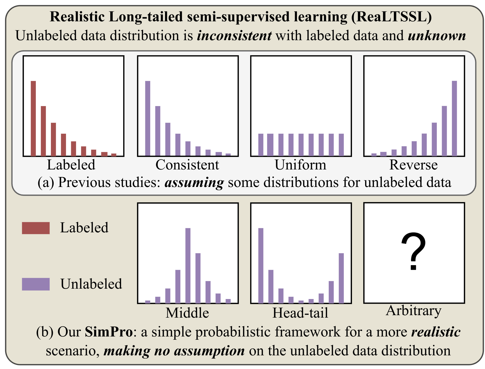
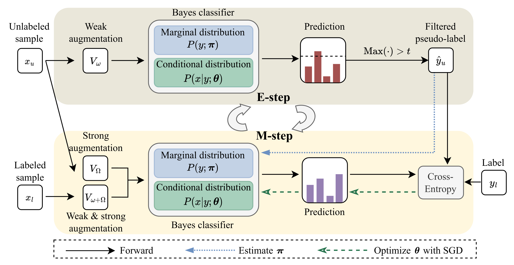
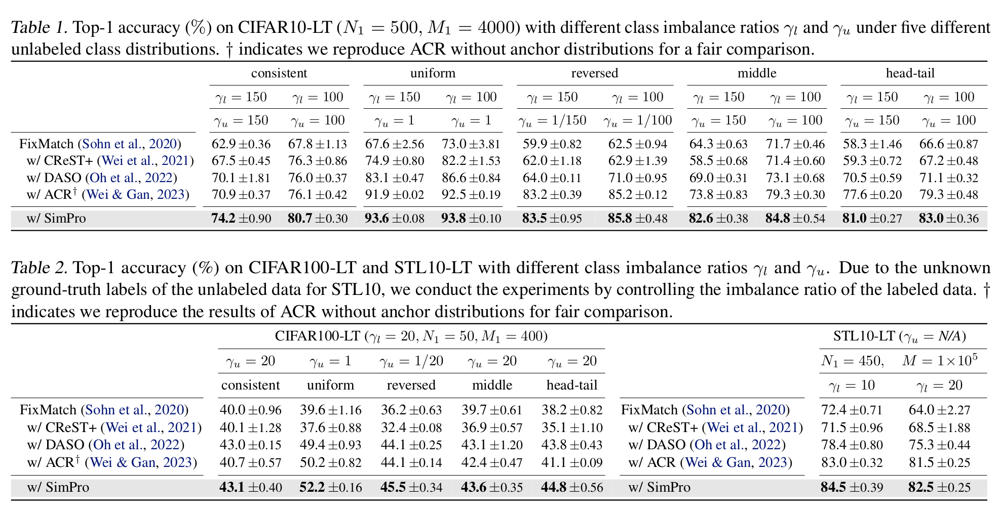
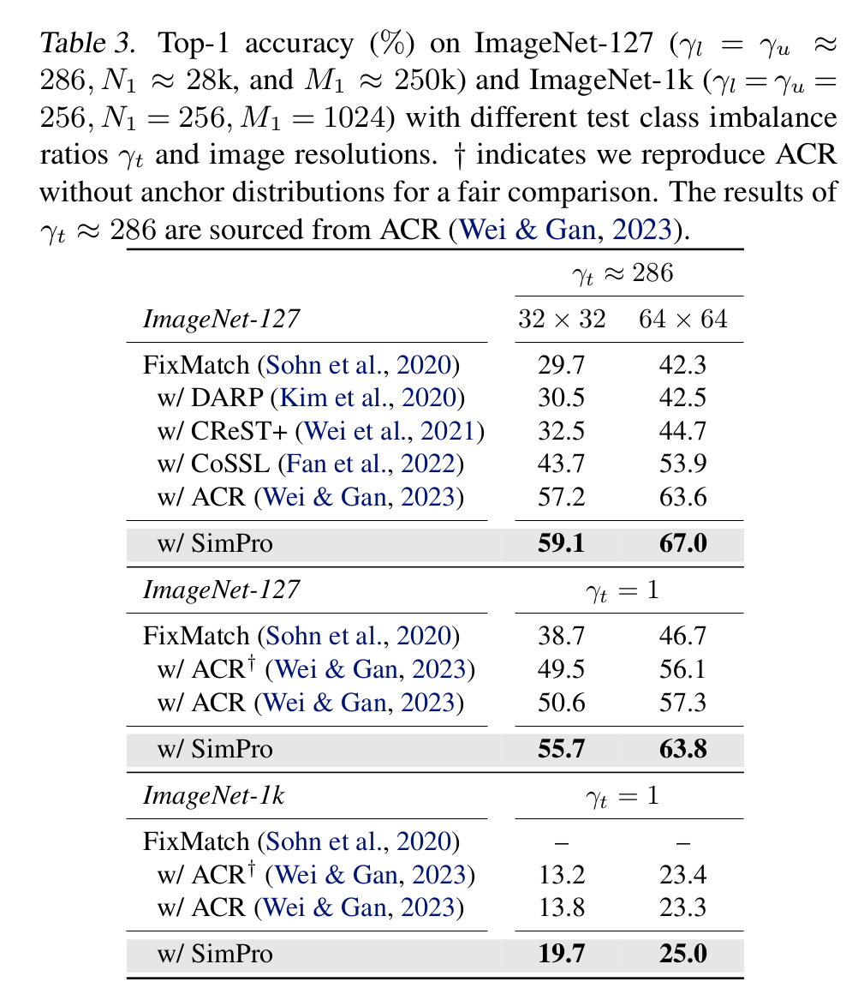

# SimPro

This repository contains the Pytorch implementation of the ICML 2024 paper [SimPro: A Simple Probabilistic Framework Towards Realistic Long-Tailed Semi-Supervised Learning](https://arxiv.org/abs/2402.13505).

Authors: [Chaoqun Du](https://scholar.google.com/citations?user=0PSKJuYAAAAJ&hl=en), [Yizeng Han](https://yizenghan.top/), [Gao Huang](https://www.gaohuang.net).

[](https://arxiv.org/abs/2402.13505)

## Introduction

<p align="center">
    
</p>

The general idea of SimPro addressing the ReaLTSSL
problem. (a) Current methods typically rely on predefined or
assumed class distribution patterns for unlabeled data, limiting
their applicability. (b) In contrast, our SimPro embraces a more
realistic scenario by introducing a simple and elegant framework
that operates effectively without making any assumptions about
the distribution of unlabeled data. This paradigm shift allows for
greater flexibility and applicability in diverse ReaLTSSL scenarios.

<p align="center">
    
</p>

The SimPro Framework Overview. This framework distinctively separates the conditional and marginal (class) distributions.
In the E-step (top), pseudo-labels are generated using the current parameters $\theta$ and $\pi$.
In the subsequent M-step (bottom), these pseudo-labels, along with the ground-truth labels, are utilized to compute the Cross-Entropy loss, facilitating the optimization of network parameters $\theta$ via gradient descent.
Concurrently, the marginal distribution parameter $\pi$ is recalculated using a closed-form solution based on the generated pseudo-labels.

## Performance

<p align="center">
    
</p>
<p align="center">
    
</p>

## Get Started

### Requirements

- python 3.9
- numpy 1.25.2
- Pillow 9.2.0
- Requests 2.28.1
- scipy 1.9.3
- torch 1.12.1
- torchvision 0.13.1

The above environment is recommended, but not necessary. You can also use other versions of the packages.

### Datasets

Follow the instructions from [here](https://github.com/YUE-FAN/CoSSL/tree/main/prepare_small_imagenet_127) to download small_imagenet_1k_32 & small_imagenet_1k_64 datasets and prepare small_imagenet_127_32 & small_imagenet_127_64 datasets.

The default data path is set to `/home/data/` and the data structure should be as follows:

```[bash]
/home/data/
├── cifar-10
├── cifar-100
├── stl-10
├── small_imagenet_127_32
├── small_imagenet_127_64
├── small_imagenet_1k_32
└── small_imagenet_1k_64
```

### Training

By default, we use 1 RTX3090 GPU for CIFAR/STL10/ImageNet-127/1k ($32\times32$) datasets and 1 A100 GPU (40G) for ImageNet-127/1k ($64\times64$) dataset.

```[bash]
bash sh/${method}.sh ${dataset} ${exp_index} #comment for the experiment setting

bash sh/SimPro.sh cifar10 0          #gamma_l=150 consistent
bash sh/SimPro.sh cifar10 1          #gamma_l=150 uniform
bash sh/SimPro.sh cifar10 2          #gamma_l=150 reversed
bash sh/SimPro.sh cifar10 3          #gamma_l=150 middle
bash sh/SimPro.sh cifar10 4          #gamma_l=150 head-tail
bash sh/SimPro.sh cifar10 5          #gamma_l=100 consistent
bash sh/SimPro.sh cifar10 6          #gamma_l=100 uniform
bash sh/SimPro.sh cifar10 7          #gamma_l=100 reversed
bash sh/SimPro.sh cifar10 8          #gamma_l=100 middle
bash sh/SimPro.sh cifar10 9          #gamma_l=100 head-tail

bash sh/SimPro.sh cifar100 0         #gamma_l=20 consistent
bash sh/SimPro.sh cifar100 1         #gamma_l=20 uniform
bash sh/SimPro.sh cifar100 2         #gamma_l=20 reversed
bash sh/SimPro.sh cifar100 3         #gamma_l=20 middle
bash sh/SimPro.sh cifar100 4         #gamma_l=20 head-tail

bash sh/SimPro.sh stl10 0            #gamma_l=10
bash sh/SimPro.sh stl10 1            #gamma_l=20

bash sh/SimPro.sh smallimagenet    0 #gamma_t=1 ImageNet-127 32*32
bash sh/SimPro.sh smallimagenet    1 #gamma_t=1 ImageNet-127 64*64
bash sh/SimPro.sh smallimagenet_1k 0 #gamma_t=1 ImageNet-1k  32*32
bash sh/SimPro.sh smallimagenet_1k 1 #gamma_t=1 ImageNet-1k  64*64

bash sh/ACR_d.sh ...
```

ACR_d is a variant of ACR baseline without pre-defined anchor distributions, corresponding to ACR$^\dagger$ in the paper.
We modified the computation of `adjustment_l1` by replacing the dynamic tau (estimated from the anchor distributions) with a fixed tau1. Specifically, we only changed:

```python
args.adjustment_l1 = compute_adjustment_by_py(args.py_con, tau, args)
```

to:

```python
args.adjustment_l1 = compute_adjustment_by_py(args.py_con, args.tau1, args)
```

## Citation

If you find this code useful, please consider citing our paper:

```[tex]
@inproceedings{du2024simpro,
    title={SimPro: A Simple Probabilistic Framework Towards Realistic Long-Tailed Semi-Supervised Learning},
    author={Chaoqun Du and Yizeng Han and Gao Huang},
    booktitle={Forty-first International Conference on Machine Learning},
    year={2024},
}
```

## Contact

If you have any questions, please feel free to contact the authors. Chaoqun Du: <dcq20@mails.tsinghua.edu.cn>.

## Acknowledgement

Our code is based on the ACR (Towards Realistic Long-Tailed Semi-Supervised Learning: Consistency Is All You Need).
